**在线体验或二次开发过程中遇到问题、功能建议、代码优化意见欢迎提出Issues**

**后续计划在2025年1月中旬之前，陆续将相关文档整理完成于项目开发文档模块**

*下载项目请点击发行版进行最新版本的下载，master 分支存在未开发完成的功能*

#### 线上体验地址
> 为完整体验项目功能，请自行注册账号体验

http://120.26.52.238/

#### 功能介绍
[介绍视频](https://www.bilibili.com/video/BV14Z1oY8EKh/?spm_id_from=333.1007.0.0&vd_source=3635d5214bc4b48c5071c18a6643fec8)

#### 数据库脚本默认账号密码
账号：admin

密码：admin123

#### 本地开发环境
Java 21

MySQL 8+

node 20+

Redis

#### 关于狸花猫

狸花猫是一款基于 **SpringBoot** **和** **Vue** 的权限管理系统

##### 为什么叫狸花猫

家里养了两只狸花猫，想以他们作为系统的主题。用任何一只的名字命名都不太好，干脆就按品种来命名了。

##### 系统功能

系统包含完整的基于角色控制的 RBAC 权限管理系统，包括菜单管理、角色管理和用户管理。此外，还提供部门和岗位管理，适用于大多数业务场景，用户支持多部门并可指定默认部门，前后端均提供接口获取用户的默认信息。

##### 字典管理

系统字典支持普通字典和树形字典，并提供工具类用于获取和翻译字典信息，前端还提供 dict-tag 组件，可以通过字典 value 直接展示字典 label，并自动匹配 tag 样式。

##### 通知公告

通知公告集成了 Vditor 富文本解析器，并使用 SSE 实现了消息的实时发送与接收。

##### 个人中心

个人中心支持个性化系统主题配置，支持主题、布局、导航等页面设置。

##### 系统设置

管理员角色用户可以对系统进行进一步配置，包括默认密码设置、定期修改密码、同账号登录限制、自助注册配置、登录验证码开关、IP 黑名单和灰色模式。

##### 其他功能

系统还提供了日志服务、在线用户监控、缓存监控、服务监控以及定时任务等功能。

##### 系统截图

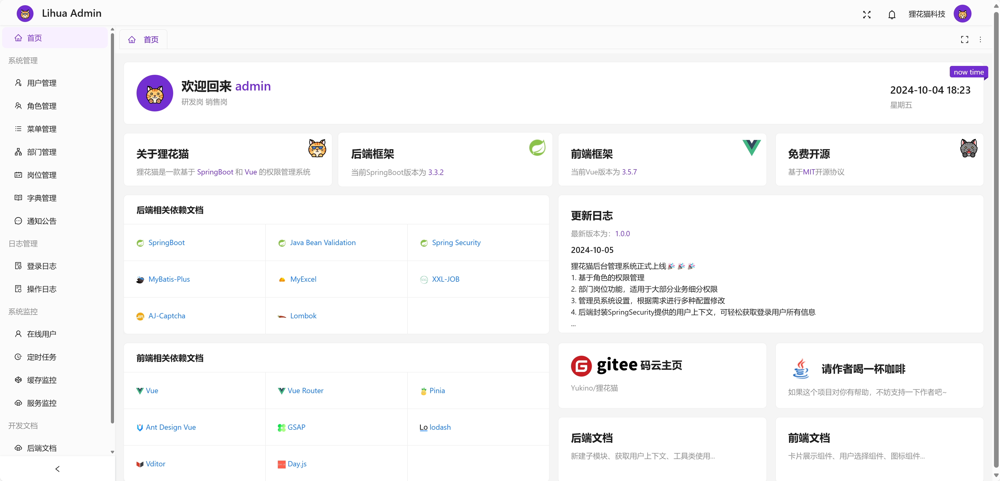

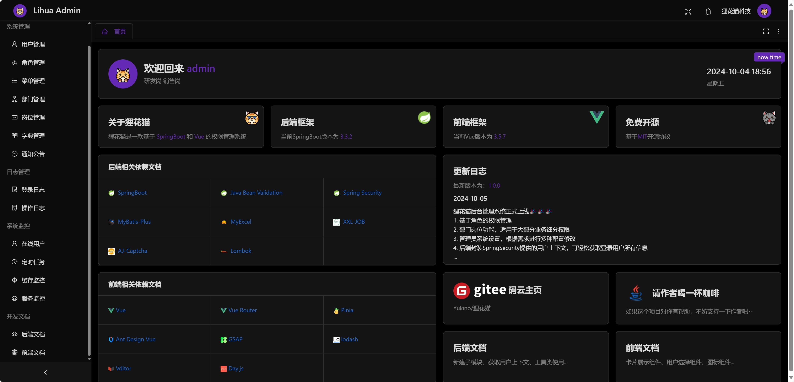

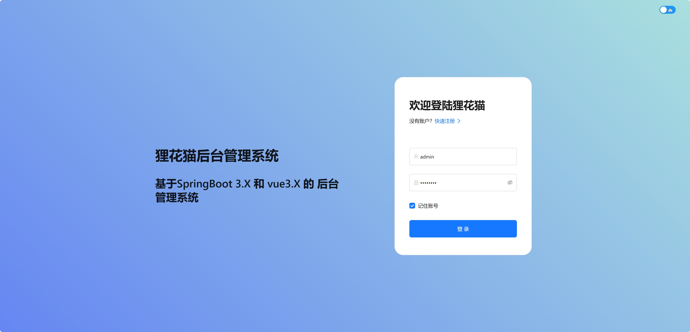

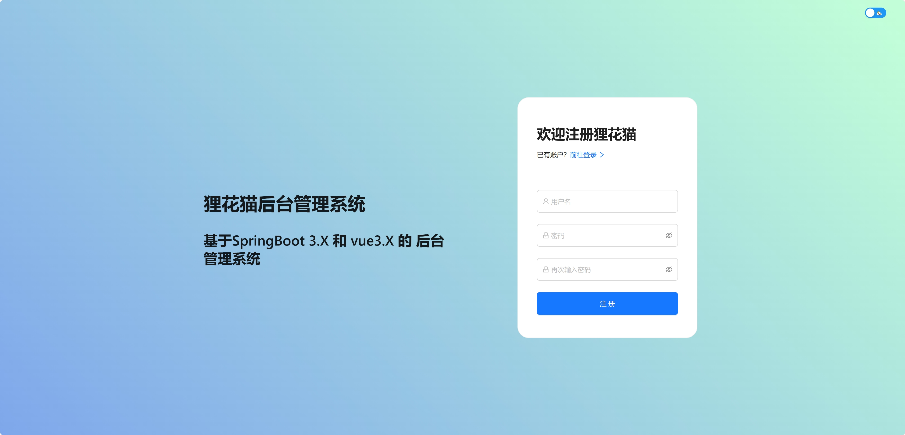

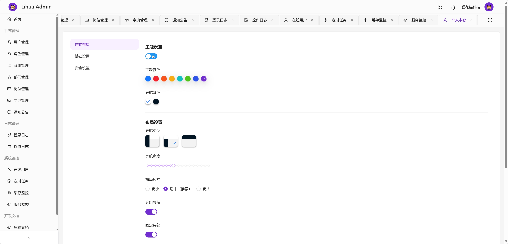

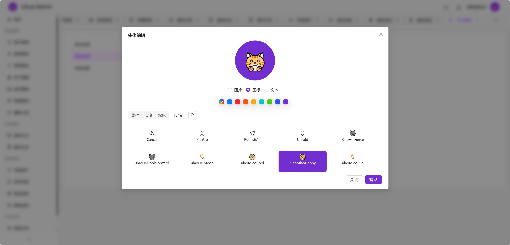

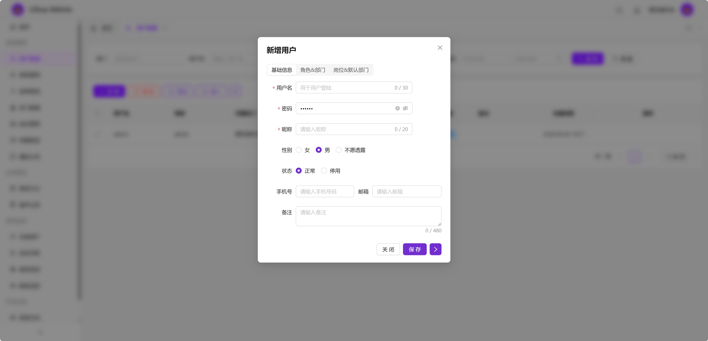

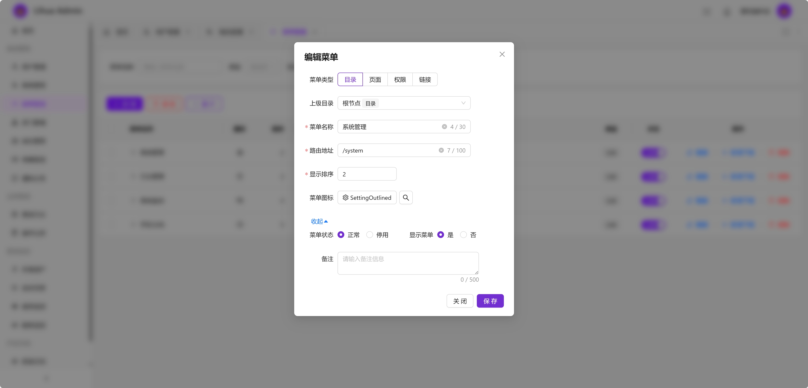

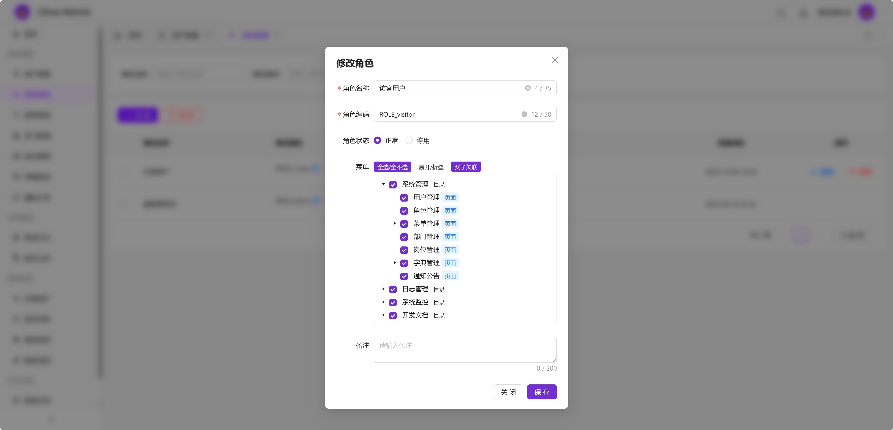

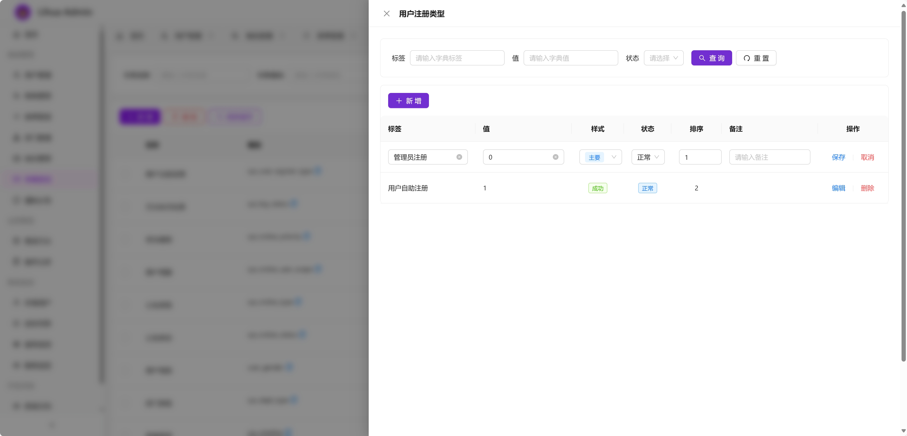

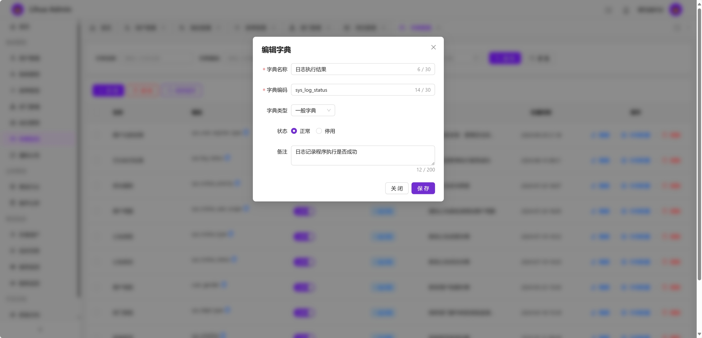

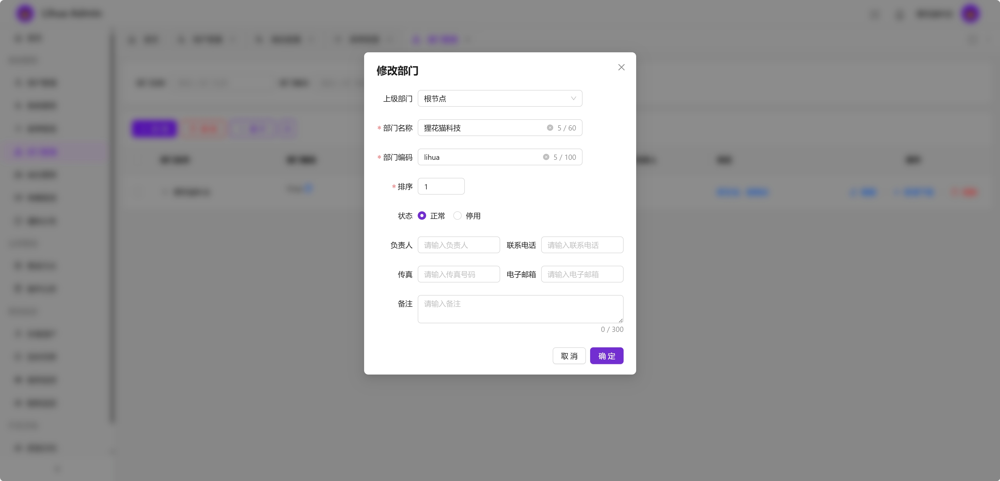

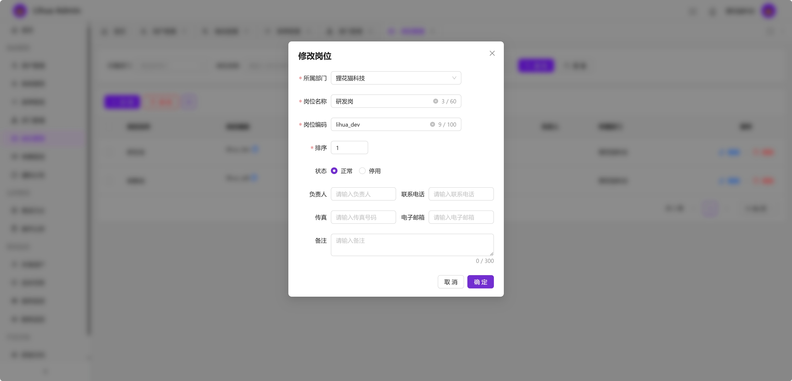

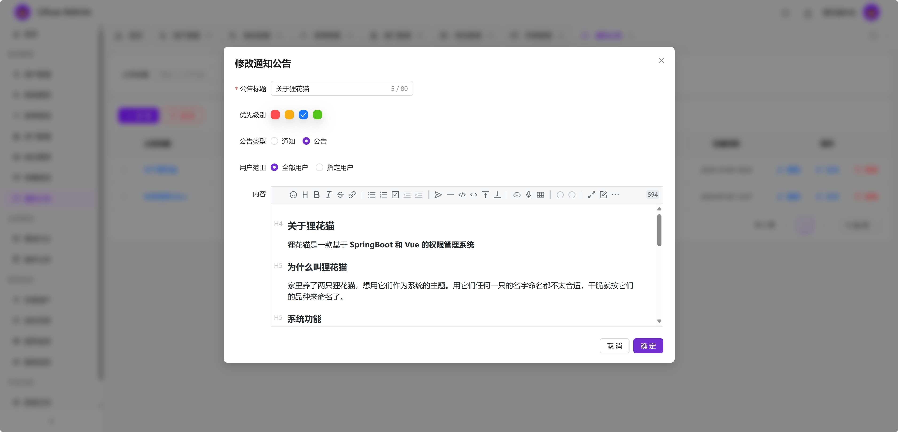

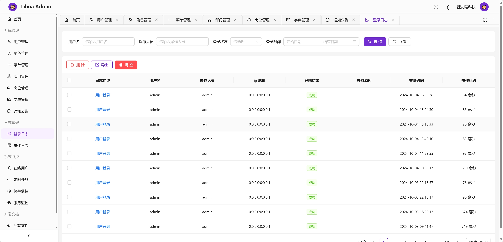

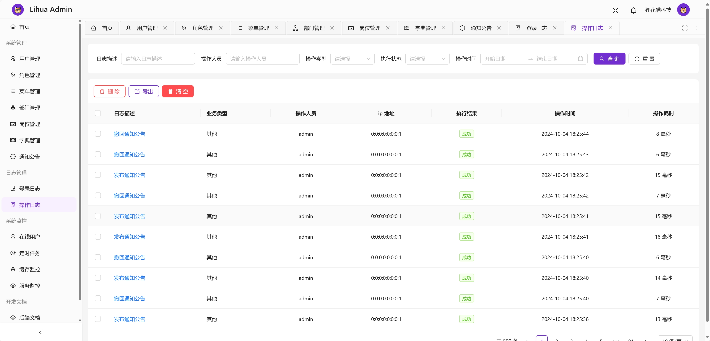

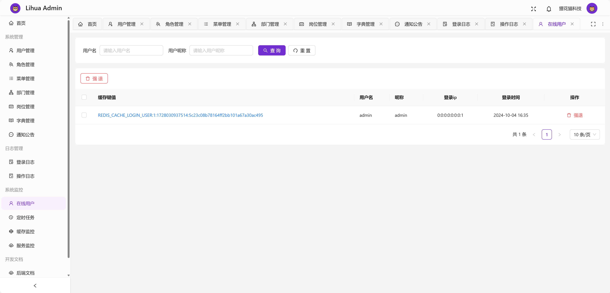

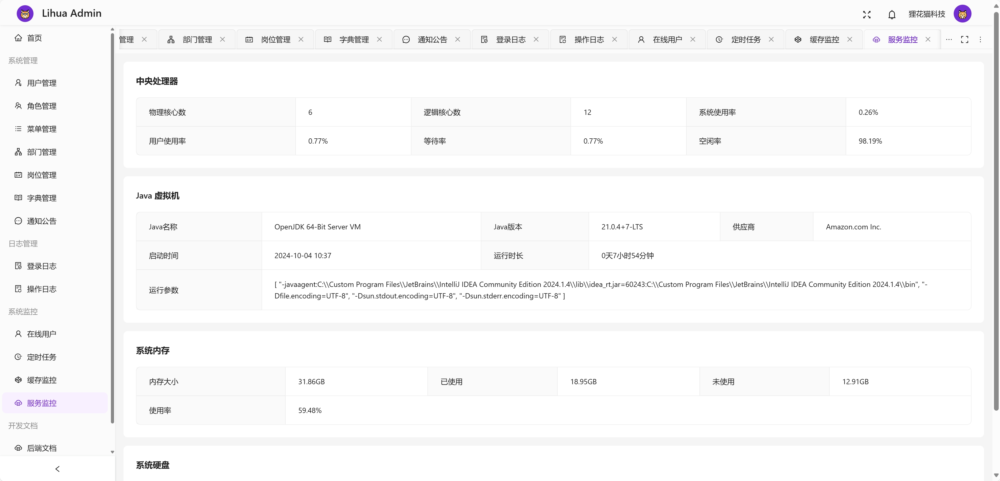

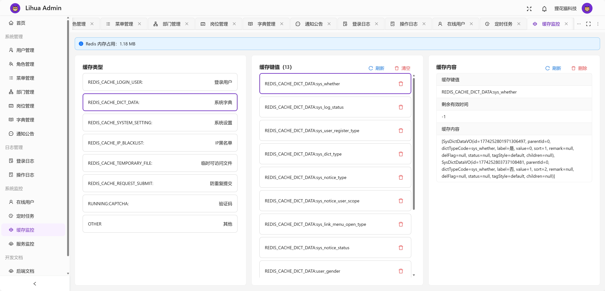

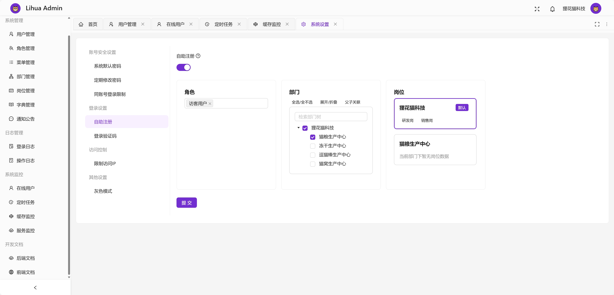

